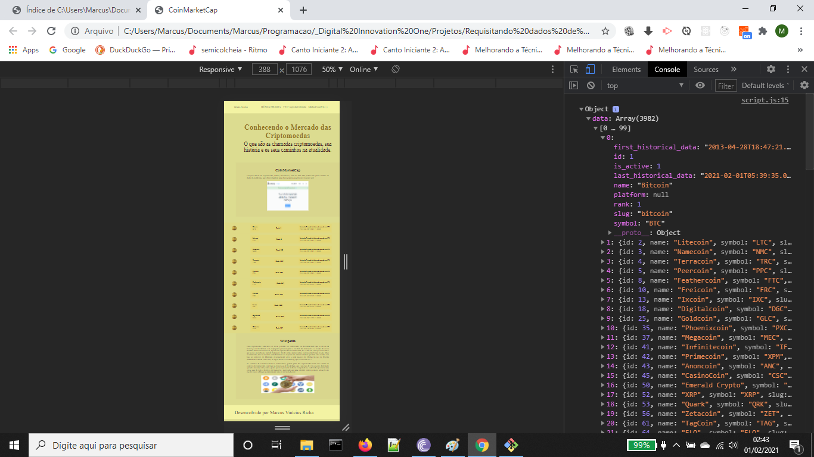
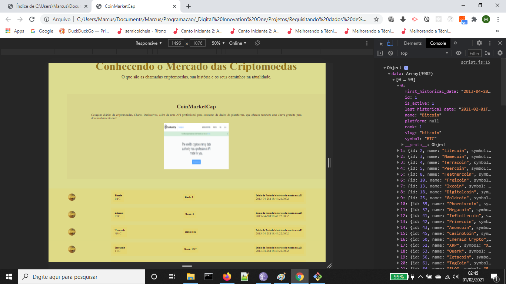
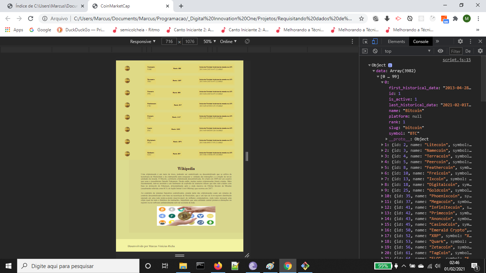

# Projeto Front-end - API Criptomoedas

Aprendendo a fazer uma requisição de uma API de Criptomoeda com Javascript, utilizando também CSS Flexbox property.   

Projeto Web utilizando a API Coin Market Cap  
[Portal do desenvolvedor](https://pro.coinmarketcap.com/account)  
[Documetação de autenticação](https://coinmarketcap.com/api/documentation/v1/#section/Authentication)  
[Documentação API](https://coinmarketcap.com/api/documentation/v1/#)  

###### Orientação: professora Bárbara Casac da Digital Innovation One.

### Imagens do resultado final do projeto API Criptomoedas

1. Imagem da tela inteira com a API de Criptomoedas ativa

2. Foco sobre a parte da página que contém o elemento HTML da api

3. Parte final da página, mostrando os elementos da API, seção da Wikipedia sobre criptomoedas e o elemento _footnote_.

